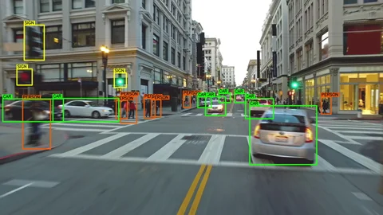

#  Video object detection

## Overview

In this project, we implement a video object detection program that takes an AVI video as input and detects the classes of objects along with their corresponding probabilities using the `yolo11m` model (you can change the model depending on your GPU performance). The classes detected will be those that the YOLO model has been trained on.

## Usage

- Replace `input_video.avi` with your input video.
- Execute `main.py` to start processing the video.
- The output will include the processed video and a report text file that contains the main statistics during processing.

<video width="640" height="360" controls>
  <source src="input_output/output_video.mp4" type="video/mp4">
  Your browser does not support the video tag.
</video>

## Note
 
You can change the objects detected in the report by modifying the value of the `high_confidence_threshold` variable in `yolo_frame_processor.py` (the default is 0.9). This allows you to exclude objects that appear with non-very high probabilities.

## Requirements

- PyTorch version: 2.5.1+cu121
- OpenCV version: 4.10.0
- psutil version: 5.9.5
- tqdm version: 4.67.1
- NumPy version: 1.26.4
- Ultralytics version: 8.3.52

